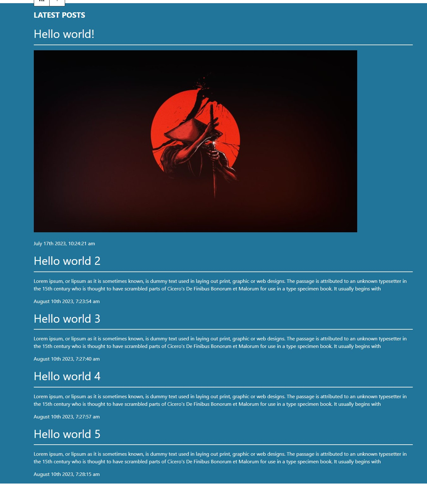
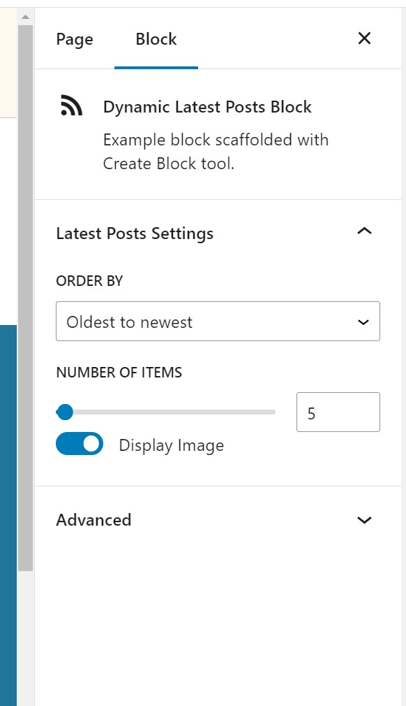

# Dynamic-latest-posts-block
A gutenberg Dynamic block for wordpress gutenberg block editor. This plugin allow user to add a block that will get all the latest posts. User will be be able to specifiy how many posts he/she wants to display. User will be able select whether featured images should be displayed with the blocks or not. This block also has sorting functionality based on order of the posts.

## Project Display


\
\


## Built With

- VsCode
- React
- Wordpress block editor and components

# Getting Started

To get a local copy of the repository please run the following commands on your terminal:

```bash

$ git clone to plugin folders in wordpress site `https://github.com/ajkacca457/Dynamic-latest-posts-block.git`
$ cd Dynamic-latest-posts-block
$ Run `npm install` to install the necessary modules.
$ Run `npm run start` to start client server.

```

# Future development pipeline

To run test in your terminal:

- adding display order option for images and texts.
- adding transition animation dynamically.
- adding border manipuration for the card item.
- adding custom background and font selection.


# Authors

👤 **Avijit Karmaker**

- Github: [@Avijit](https://github.com/ajkacca457)
- Linkedin: [@Avijit](https://www.linkedin.com/in/avijit-karmaker-8738a54)

## 🤝 Contributing

Contributions, issues and feature requests are welcome!

## Show your support

Give a ⭐️ if you like this project!

## Copyright

This is a project developed by Avijit.
